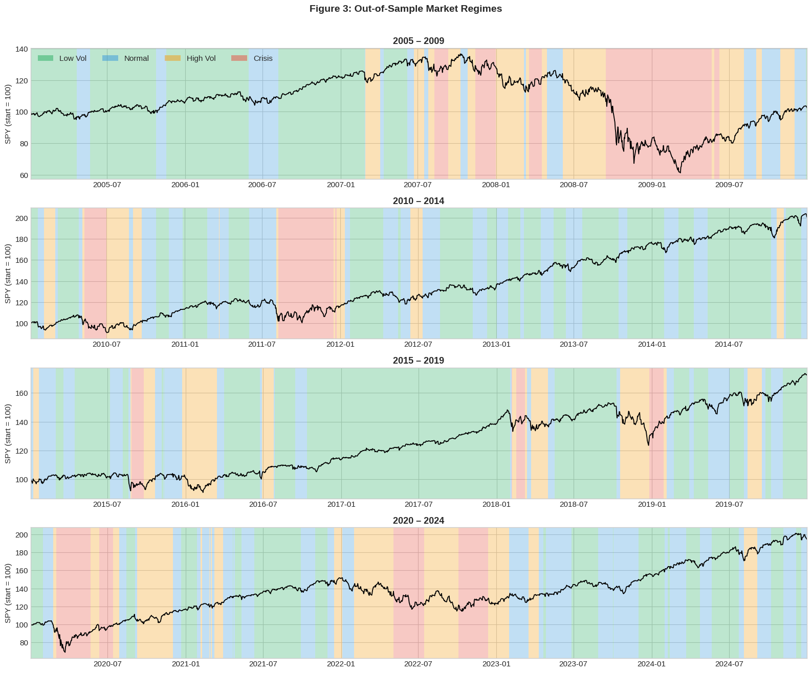
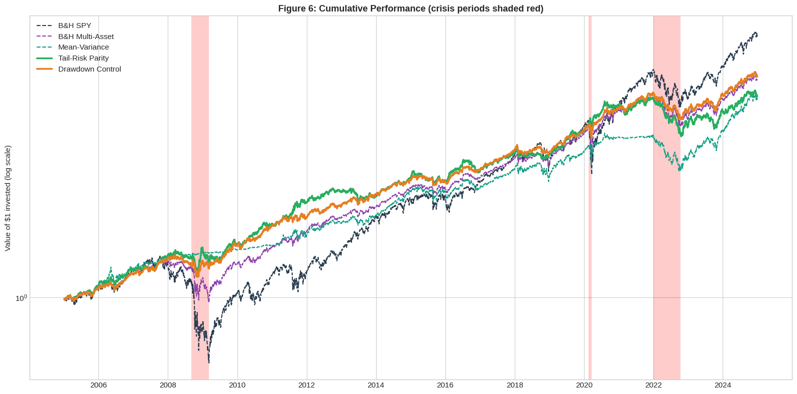
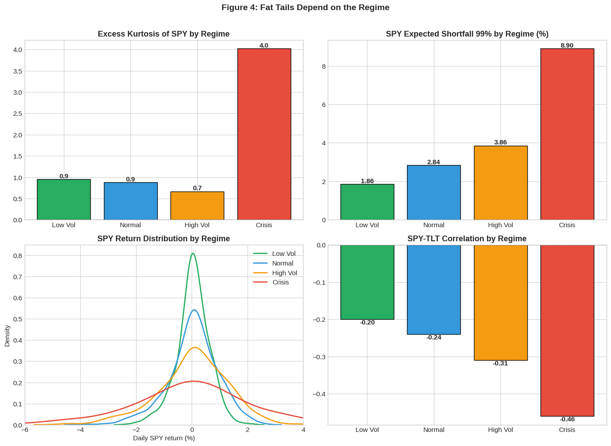
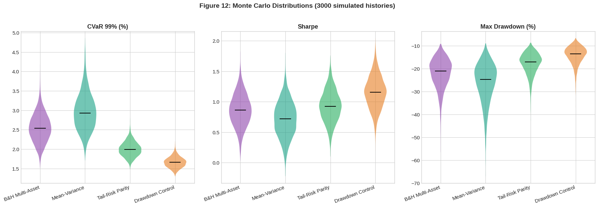

# Regime-Aware Portfolio Protection Against Fat-Tail Risk

This is the code for my Master's thesis in Operations Research and Business Analytics at Otto von Guericke University Magdeburg (2026). I slightly refurbished it after revision, with a fresh state of mind.

The question I wanted to answer: can a portfolio that adapts to the market regime reduce fat-tail risk (measured as Expected Shortfall at 99%) compared to a static multi-asset portfolio, without giving up risk-adjusted returns?

## Background

Stock returns have fat tails. Big losses happen far more often than a normal distribution would predict, and how often depends a lot on the market environment. In calm years daily returns look almost normal. In a crisis they don't look normal at all.

That made me think a portfolio shouldn't protect itself the same way all the time. It should first figure out what kind of market it is in, and then react.

## How it works

To find the market regime, I use a Hidden Markov Model with four states, which I call Low Vol, Normal, High Vol and Crisis. It looks at only two things: SPY's daily return and its 21-day realized volatility. The model is refitted every January using only data before that year, starting in 1994. So every regime label from 2005 onwards is genuinely out-of-sample. Each day is classified with the forward algorithm, which only uses data up to that day. Strategies then trade on yesterday's regime.

One thing that took me some time: an HMM numbers its states randomly, so "state 2" this year might be "state 0" next year. To keep the labels consistent, I match every new fit to the first one by comparing the states' Gaussian distributions with the KL divergence.

On top of the regimes I built two strategies:

- **Tail-Risk Parity** weights SPY, TLT and Gold by the inverse of their Expected Shortfall in the current regime. When the market gets stressed, SPY's tail risk rises much faster than that of bonds or gold, so the equity weight drops on its own. The ES estimates are updated every quarter from past data only.
- **Drawdown Control** works a bit like CPPI. Each regime has its own equity target, and once the portfolio falls too far below its previous peak, equity gets cut, harder in stressed regimes. There is also a "kurtosis brake" that reduces equity further when SPY's tails over the past year have been extreme.

I compare both with three benchmarks: 100% SPY, a fixed 55/25/10/10 mix of SPY, TLT, Gold and SHY, and a classic mean-variance portfolio. The mean-variance one re-estimates means and covariances from the last three years every month and holds the long-only portfolio with the highest Sharpe ratio. It's dynamic like my strategies, but it knows nothing about regimes or tails, so it shows whether regime-awareness adds anything beyond regular re-estimation.

I test everything in three ways: a backtest from 2005 to 2024 including transaction costs, a closer look at the GFC, COVID and the 2022 bear market, and a Monte Carlo simulation. In the simulation, the same strategy code runs on 3,000 made-up 20-year histories. These are built by stitching together real 5-day blocks from each regime, following the regime transition probabilities I estimated.

## Results

Short answer: yes. Both strategies cut the tail risk clearly, and neither paid for it with a worse Sharpe ratio.

Backtest 2005–2024, after transaction costs:

| | Annual return | Sharpe | ES 99% (daily) | Max drawdown |
|---|---|---|---|---|
| 100% SPY | 10.3% | 0.44 | 5.11% | −55.2% |
| 55/25/10/10 multi-asset | 8.5% | 0.64 | 2.59% | −27.5% |
| Mean-variance | 7.8% | 0.67 | 2.25% | −24.9% |
| **Tail-Risk Parity** | 7.9% | 0.67 | **1.93%** | −25.4% |
| **Drawdown Control** | 8.7% | **0.85** | **1.78%** | **−18.4%** |

Drawdown Control is the clear winner. It reduces ES 99% by about 31% compared with the multi-asset portfolio and still earns a slightly higher return. Tail-Risk Parity reduces ES by about 25%, with a Sharpe ratio similar to the benchmarks. In the Monte Carlo simulation, both strategies have a lower ES than the multi-asset portfolio in more than 99% of the 3,000 histories. Drawdown Control also has a higher Sharpe ratio in 99.5% of them, Tail-Risk Parity in about 64%.

The crises show where this works and where it doesn't. In the GFC both strategies lost about 4%, while the multi-asset portfolio lost 23%. COVID was too fast for a full escape: the strategies still had drawdowns of 10–13%, but less than the 17% of the multi-asset portfolio. In 2022, though, nothing helped much: stocks and bonds fell together, so moving out of equities into TLT didn't protect anything. Regime detection can tell you that markets are stressed, but it can't fix a diversifier that stops diversifying.

The mean-variance benchmark is a nice reminder of why estimating expected returns is hard. It was almost fully out of equities during the GFC (and gained 0.9%), but its equity weight jumps between 0% and 100%, and in the Monte Carlo simulation it has the worst tail risk of all.

| Regimes over time | Cumulative performance |
|---|---|
|  |  |

| Fat tails by regime | Monte Carlo |
|---|---|
|  |  |

The full tables (performance, crisis periods, Monte Carlo probabilities) are in the notebook.

## Things to keep in mind

Gold is the front-month futures price (`GC=F`), not a total-return series. Daily rebalancing back to target weights is assumed to be free; only changes made by the strategies cost money.

Tail-Risk Parity looks at each asset's ES on its own and ignores correlations between them.

In the Monte Carlo simulation the strategies know the true regime (with a one-day delay), while in the backtest they have to rely on the HMM. So the simulation is the optimistic case where regime detection works well. The simulated Sharpe ratios are also higher across the board than in the backtest, probably because the 5-day blocks only come from stretches that stayed in one regime, and the turbulent days around regime switches are left out. That affects all strategies the same way, so I read the simulation as a comparison between strategies, not as a forecast of absolute returns.

The strategy parameters (equity targets, drawdown thresholds and so on) were set by reasoning. I didn't optimize them, which also means I didn't fit them to the backtest.

## Running it

The easiest way is Google Colab. Open the notebook and click *Runtime → Run all*. A full run takes about 25–35 minutes, mostly for fitting the HMMs and running the Monte Carlo simulation. Data comes from Yahoo Finance via `yfinance`.

To run it locally:

```bash
pip install -r requirements.txt
jupyter notebook regime_aware_portfolio_protection.ipynb
```

## References

- Baur, D. G., & Lucey, B. M. (2010). Is gold a hedge or a safe haven? An analysis of stocks, bonds and gold. *Financial Review*, 45(2), 217–229.
- Künsch, H. R. (1989). The jackknife and the bootstrap for general stationary observations. *The Annals of Statistics*, 17(3), 1217–1241.

Some parts of the code build on these sources:

- hmmlearn docs: [model selection with BIC](https://hmmlearn.readthedocs.io/en/latest/auto_examples/plot_gaussian_model_selection.html), [tutorial](https://hmmlearn.readthedocs.io/en/latest/tutorial.html)
- QuantStart: [regime detection with HMMs](https://www.quantstart.com/articles/market-regime-detection-using-hidden-markov-models-in-qstrader/), [drawdown tracking](https://www.quantstart.com/articles/Event-Driven-Backtesting-with-Python-Part-VII/)
- QuantInsti: [walk-forward regime trading](https://blog.quantinsti.com/regime-adaptive-trading-python/)
- [PyPortfolioOpt](https://github.com/robertmartin8/PyPortfolioOpt) (MIT) for inverse-risk weighting
- [quantstats](https://github.com/ranaroussi/quantstats) (Apache-2.0) for the CVaR and tail ratio definitions
- [fedormlevin/cppi-industry-portfolio](https://github.com/fedormlevin/cppi-industry-portfolio) for the CPPI idea
- [CMU Sphinx divergence.py](https://github.com/skerit/cmusphinx/blob/master/SphinxTrain/python/cmusphinx/divergence.py) (BSD) for the KL divergence between Gaussians
- israeldi: [Monte Carlo simulation of a stock portfolio](https://israeldi.github.io/bookdown/_book/monte-carlo-simulation-of-stock-portfolio-in-r-matlab-and-python.html)
